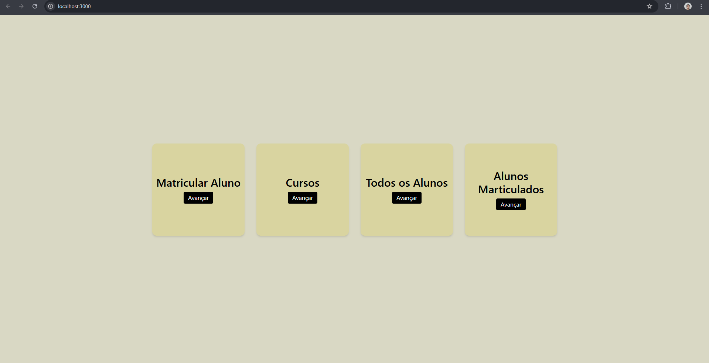
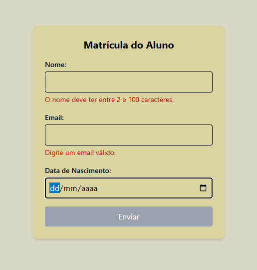
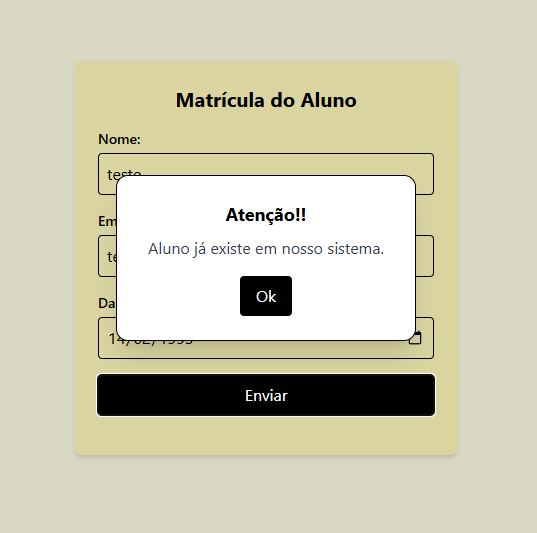
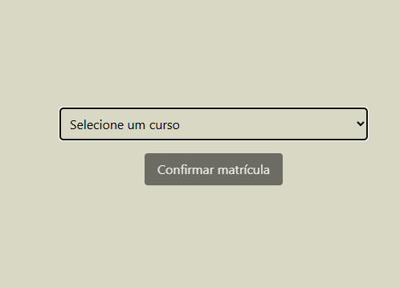
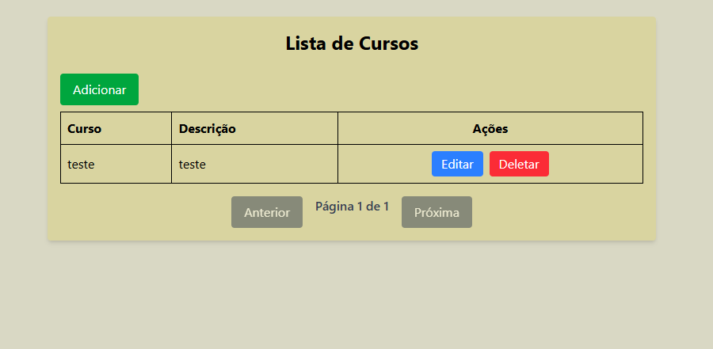
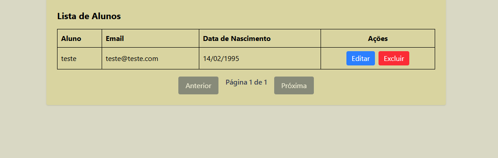
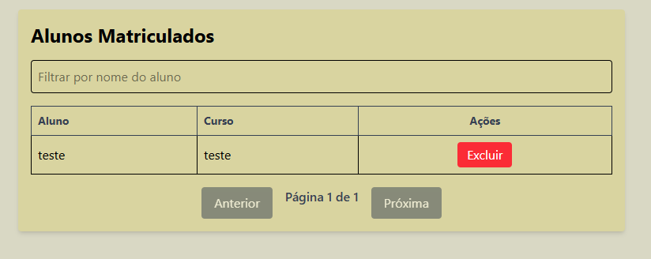

# Configurando projeto

- Tenha instalado Docker Desktop e docker compose na máquina.
- execute o comando no mesmo nível do docker-compose.yaml: `docker compose up --build`
- A aplicação estará rodando: `http://localhost:3000/`

# Sobre o projeto

### A página inicial
- Matrícula: onde você registra um aluno e seleciona um curso (o curso precisa ser adicionado antes).
- Cursos: onde você adiona um curso.
- Todos os alunos: onde você pode editar e excluir (caso não esteja matriculado) um aluno.
- Alunos Matriculados: lista de todos os alunos que possuem uma matrícula.

### /matricula

- Formulário matrícula possui validações no frontend para preenchimento correto dos dados nome email e data. 

- O botão de enviar fica disponível assim que todos os campos são preenchidos corretamente.

- Alguns modais são apresentados para informações de processo que podem alertar que aluno já existe, curso criado com sucesso, confirmação para excluir um aluno, ou matrícula.
- Nesse caso como foi feita uma nova matrícula a um aluno existente a mensagem será essa:

- A próxima etapa será a seleção de curso.

### /cursos

- Tabela de cursos: nela é possível excluir, editar e adicionar um curso.
- A tabela possui paginação com 5 itens por página.

### /alunos

- Lista de todos os alunos matriculados ou não matriculados em um curso.
- Apenas alunos não matriculados poderam ser excluídos.
- Para excluir um aluno que está matrículado primeiro terá que excluir a matrícula do aluno em `/matriculados`.
- Caso tente excluir um aluno matriculado um modal de aviso informará que ele possui uma matrícula.

### /matriculados

- Lista apenas os alunos que possuem matrículas
- Filtro de nomes busca aluno quem vem direto da base de dados

  

 

# Tecnologias e bibliotecas

- Docker
- React
- Git
- TypeScript
- MySQL
- Entity Framework core
- asp.net core 8
- FluentValidation
- Automapper
- Tailwind

 

# Entidades e relacionamentos

### Entidade Aluno  
- Tabela: Alunos  
- Chave primária: Id

- Propriedades:

    - Name: obrigatório, máximo 100 caracteres.

    - Email: obrigatório, máximo 100 caracteres.

    - DataNascimento: obrigatório.

- Relacionamentos:

    - Um aluno pode possuir várias matrículas (HasMany).

  

### Entidade Curso
- Tabela: Cursos
- Chave primária: Id
- Propriedades:
    - Name: obrigatório, máximo 100 caracteres.
    - Description: obrigatório, máximo 100 caracteres.
- Relacionamentos:
    - Um curso pode ter várias matrículas associadas.

 

### Entidade Matricula
- Tabela intermediária (não nomeada explicitamente).
- Propriedades:
    - AlunoId: chave estrangeira para Aluno.
    - CursoId: chave estrangeira para Curso.
- Relacionamentos Aluno → Matrícula
    - Um aluno pode ter várias matrículas.
    - Restrição: DeleteBehavior.Restrict
        - Impede a exclusão de um aluno caso existam matrículas associadas.

- Curso → Matrícula
    - Um curso pode ter várias matrículas.
    - Restrição: DeleteBehavior.Cascade
        - Ao excluir um curso, todas as matrículas associadas a ele também serão excluídas automaticamente.

 

### Regras e Comportamentos Importantes
- Os dados exigem preenchimento obrigatório para campos essenciais (Name, Email, DataNascimento, Description).

- O comportamento Restrict evita perda de integridade ao tentar deletar alunos com vínculos.

- O comportamento Cascade permite limpeza automática de matrículas ao remover cursos.